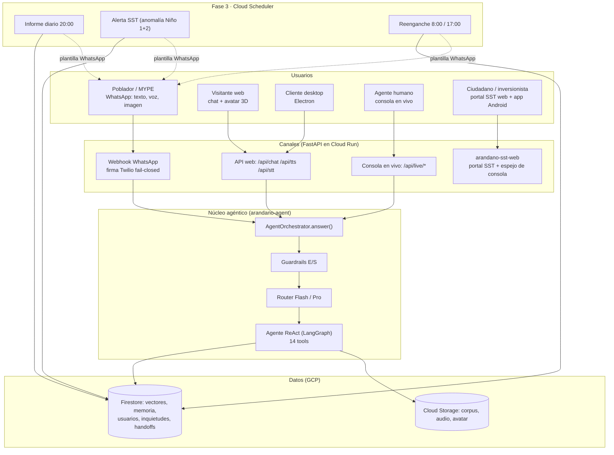
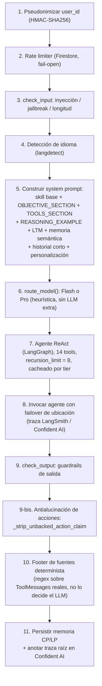
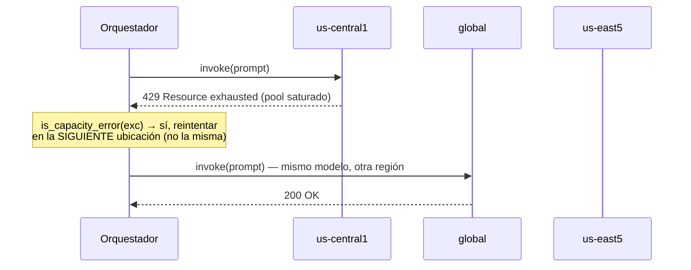
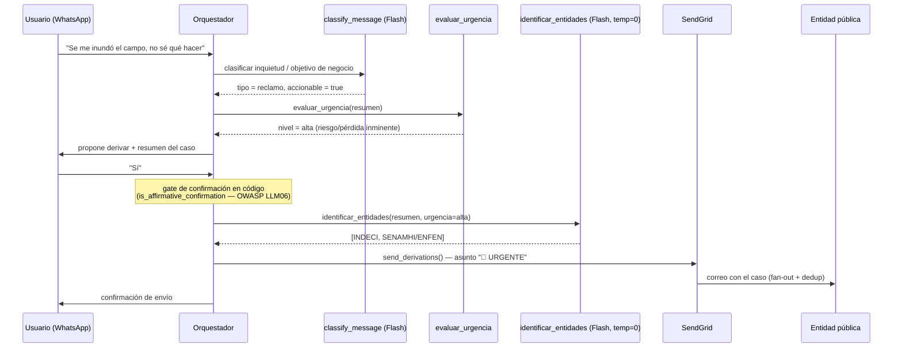
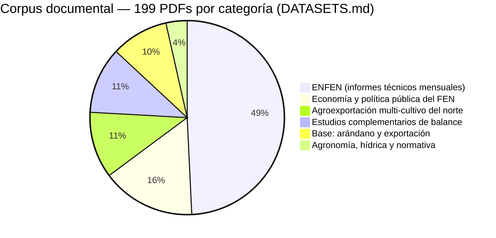
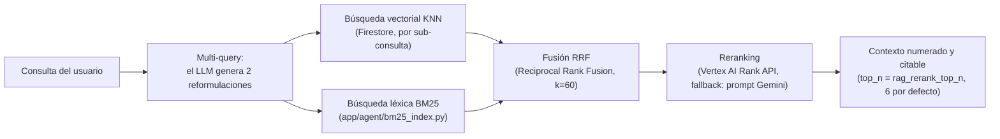

# SITFEN — Sistema de Información Temprana del Fenómeno "El Niño" para MYPEs Agrícolas

Asistente conversacional agéntico (IA generativa + RAG avanzado) que atiende por
**WhatsApp (texto, voz e imagen)** a las MYPEs agroindustriales y pobladores del norte del
Perú, cruza señales tempranas del **Fenómeno de El Niño** (SST, ENFEN, NOAA) con un corpus
documental de 199 fuentes, y **canaliza cada caso a la entidad pública correcta**
(SENASA, SENAMHI/ENFEN, INDECI, MIDAGRI, CITEagroindustrial Chavimochic, RedCITE,
PROMPERÚ, SUNAT, Gobierno Regional, Municipalidad) o a un humano cuando corresponde.
Se complementa con un **portal web de monitoreo satelital SST**, una **app Android** y una
**interfaz de administración** para el control de usuarios y la carga del corpus. 100%
desplegado en **Google Cloud Platform**, serverless, costo mínimo.

> Capstone Project II — UTEC, Maestría en Ciencia de Datos & IA.

---

## Índice

1. [Arquitectura general](#1-arquitectura-general)
2. [Pipeline del agente orquestador](#2-pipeline-del-agente-orquestador)
3. [Tools del agente](#3-tools-del-agente-14-en-total)
4. [Fase 3 — canalización, escalamiento y proactividad](#4-fase-3--canalización-escalamiento-y-proactividad)
5. [RAG y corpus documental](#5-rag-y-corpus-documental)
6. [Canales y productos del sistema](#6-canales-y-productos-del-sistema)
7. [Seguridad — OWASP LLM/Agentic Top 10](#7-seguridad--owasp-llmagentic-top-10)
8. [Estructura del proyecto](#8-estructura-del-proyecto)
9. [Puesta en marcha local (sin costo)](#9-puesta-en-marcha-local-sin-costo)
10. [Despliegue en GCP (Bloque B)](#10-despliegue-en-gcp-bloque-b--incurre-costo)
11. [Evaluación de calidad](#11-evaluación-de-calidad)
12. [Metodologías y cumplimiento](#12-metodologías-y-cumplimiento)
13. [CI/CD y calidad de código](#13-cicd-y-calidad-de-código)
14. [Costos](#14-costos)

---

## 1. Arquitectura general



### Componentes y decisiones técnicas

| Requisito             | Decisión                                                                                                                        |
| ---------------------- | ------------------------------------------------------------------------------------------------------------------------------- |
| Plataforma            | **GCP**, proyecto `chatbot-agentico-v2`                                                                                         |
| IA agéntica           | **LangGraph** (agente ReAct prearmado, `create_react_agent`) + **LangChain**                                                    |
| LLM (inferencia)      | **Gemini 2.5 Flash/Pro** vía **Vertex AI / Model Garden**, ruteo determinista Flash↔Pro (sin LLM extra)                         |
| Embeddings            | **text-multilingual-embedding-002** (multilingüe: ES / EN / …)                                                                  |
| Vector store          | **Firestore Vector Search** (`FindNearest` KNN, serverless)                                                                     |
| RAG avanzado          | **búsqueda híbrida**: multi-query + KNN vectorial + **BM25** léxico, fusionados por **RRF** (Reciprocal Rank Fusion) + **reranking** (Vertex AI Rank API, con fallback a Gemini por prompt) + footer de fuentes determinista |
| Memoria               | **Firestore**: ventana corta + resumen LTM progresivo + memoria semántica; derecho al olvido (Ley 29733/GDPR)                   |
| Canalización al Estado| Catálogo cerrado de **10 entidades públicas**, clasificación por urgencia ("análisis del sentir"), correo vía **SendGrid**       |
| Canal principal       | **WhatsApp** vía **Twilio** + webhook con firma fail-closed                                                                     |
| Voz e imagen          | **Speech-to-Text** / **Text-to-Speech** + **Gemini multimodal** (descripción de fotos)                                          |
| Compute               | **Cloud Run** (agente, admin, portal SST) + **Cloud Run Jobs** (ingesta, evaluación) → híbrido serverless                       |
| Secretos              | **Secret Manager** (nada hardcodeado; ver `app/config.get_secret`)                                                              |
| Guardrails            | inyección/jailbreak, PII (Luhn), rate-limit, fuga de system prompt, sanitización de contenido externo — OWASP LLM/Agentic Top 10|
| Evaluación            | **RAGAS** + **DeepEval** (juez Gemini Pro), golden dataset de 180 preguntas sobre corpus de 199 PDFs                            |
| Monitoreo             | **LangSmith** + **Confident AI** (tracing en producción) + Cloud Logging/Monitoring/Trace                                       |
| Carga de contenidos   | **Admin UI** (Streamlit): ingesta con dedup por hash SHA-256 + control de usuarios registrados                                  |
| Idioma                | **Detección automática** (langdetect): responde en el idioma de la consulta y traduce fragmentos recuperados (ES ↔ EN, …)      |
| Validación de ingesta | MIME por *magic-bytes*, límite de tamaño, antivirus (EICAR/ClamAV opcional), bloqueo de contenido activo (macros/JS embebido), anti prompt-injection y PII antes de indexar |
| Otros canales         | Portal web SST (satélite), app Android, cliente desktop Electron, consola en vivo para handoff humano                          |
| Calidad / CI          | **ruff + mypy + pytest**, `pip-audit`, `gitleaks`, GitHub Actions, `Makefile`, lock reproducible en CI                          |

---

## 2. Pipeline del agente orquestador

`AgentOrchestrator.answer(user_id, text)` (`app/agent/orchestrator.py`) es el único punto
de entrada, invocado desde cada canal:



Errores en memoria o en el agente son **fail-open**: el usuario recibe un fallback amigable
en vez de que se rompa la conversación.

### Router de modelo (Flash ↔ Pro)

Heurística **determinista** (`app/agent/router.py`, sin llamada extra a un LLM): evalúa 3
señales en orden y se queda con la primera que aplique.

| Orden | Señal                                                                 | Resultado | Ejemplo                                              |
| ----- | ---------------------------------------------------------------------- | --------- | ----------------------------------------------------- |
| 1     | Verbo/expresión de razonamiento complejo (ES/EN: analiza, compara, por qué, recomienda, evalúa, pros/contras, tendencia, resume, impacto, riesgo, plan paso a paso, optimiza) | **Pro**   | "¿Por qué me conviene diversificar mercados?"        |
| 2     | 2 o más signos `?` en el mismo mensaje                                 | **Pro**   | "¿Qué documentos necesito? ¿Cuánto demora?"          |
| 3     | Consulta larga (≥ `router_pro_min_words`, 30 palabras por defecto)     | **Pro**   | Un mensaje largo describiendo el contexto del pedido |
| —     | Ninguna de las anteriores                                              | **Flash** | "¿Cuál es el clima en Chiclayo?"                     |

`settings.router_enabled=False` fuerza siempre Flash (interruptor de emergencia/costo).

### Memoria conversacional

| Capa                    | Alcance                                   | Mecanismo                                                                 |
| ------------------------- | -------------------------------------------- | ----------------------------------------------------------------------------- |
| Ventana corta            | Últimos `memory_max_turns` turnos (20 por defecto) | Documento Firestore por usuario, rotativa                                |
| Resumen de largo plazo (LTM) | Toda la conversación histórica            | Se regenera con un LLM cuando la ventana se desborda; se re-escanea con `detect_injection` antes de persistirse (mitigación ASI06) |
| Memoria semántica        | Recuerdos relevantes por similitud            | Embeddings aparte (`agent/semantic_memory.py`), independiente de la ventana |
| Derecho al olvido        | Toda la memoria de un usuario                 | `ConversationMemory.forget()` (Ley 29733 / GDPR)                            |

### Capacidad compartida (DSQ) y failover de ubicación

Gemini 2.5 se sirve bajo **Dynamic Shared Quota**: la capacidad es un pool compartido por
(ubicación, modelo), no una cuota del proyecto. Un `429 Resource exhausted` en una región
**no** significa que el proyecto se quedó sin cuota — los pools son independientes entre
ubicaciones, así que reintentar en la misma región no ayuda.



`_invoke_with_location_failover` (`orchestrator.py`) recorre
`settings.vertex_llm_locations` (`us-central1, global, us-east5, us-west1`) ante errores de
capacidad; cualquier otra excepción se propaga tal cual. `vertex_llm_max_retries=2` baja a
propósito el backoff dentro de cada ubicación — con DSQ conviene fallar rápido y cambiar de
pool en vez de hacer esperar un minuto al usuario. Si se agotan todas las ubicaciones, el
mensaje al usuario dice que hay mucha demanda y que reintente (no le pide "reformular").

### Antialucinación de acciones afirmadas

El texto del LLM **no es evidencia** de que una acción ocurrió. `_strip_unbacked_action_claim`
contrasta cada afirmación de "ya derivé/canalicé/escalé tu caso" contra los `ToolMessage`
reales del turno: si ninguna tool de acción **completó** la acción (prefijo `✅`, el gate de
confirmación la rechazó, o el envío falló), la respuesta se sustituye por una petición de
confirmación en vez de dejar que el usuario crea que el Estado ya fue notificado.

---

## 3. Tools del agente (14 en total)

| Grupo                  | Tool                              | Qué hace                                                                 |
| ----------------------- | ---------------------------------- | -------------------------------------------------------------------------- |
| RAG                    | `consultar_base_conocimiento` *(general)* | Búsqueda semántica general sobre todo el corpus                       |
| RAG                    | `consultar_requisitos_exportacion`| Documentación y requisitos para exportar arándano                        |
| RAG                    | `consultar_tarifas_y_costos`      | Costos, tarifas logísticas y de certificación                            |
| RAG                    | `consultar_inteligencia_comercial`| Mercados, demanda, oportunidades y competitividad                        |
| RAG                    | `resumir_contenido`               | Resumen ejecutivo de un texto o tema                                     |
| RAG                    | `presentar_documento_nuevo`       | Presenta un documento recién incorporado a la base                       |
| RAG                    | `consultar_documento_mas_reciente`| Trae el documento MÁS RECIENTE por fecha real (no similitud) de una serie periódica (ENFEN, ADEX, PROMPERÚ...); para "¿cuál es el último...?" |
| Clima / FEN            | `consultar_clima`                 | Clima actual de una ciudad/localidad vía AccuWeather                     |
| Clima / FEN            | `consultar_datos_noaa`            | Precipitación reciente (NOAA CDO) como señal temprana del FEN            |
| Gráficos (imagen)      | `graficar_temperatura_mar`        | Genera y envía un gráfico de la evolución de la SST                      |
| Gráficos (imagen)      | `graficar_precipitacion`          | Genera y envía un gráfico de la precipitación diaria NOAA                |
| Imagen IA              | `generar_imagen`                  | Genera y envía una imagen **ilustrativa** por IA (no un dato real); no reemplaza los gráficos de datos reales ni el análisis de fotos del usuario |
| Canalización al Estado | `derivar_solicitud_entidad`       | Canaliza por correo un caso a las entidades públicas pertinentes          |
| Canalización al Estado | `escalar_a_humano`                | Avisa al equipo humano para que una persona retome la conversación        |

Las descripciones de la tabla son las mismas que el propio agente recibe en su system prompt
(`SKILL_REGISTRY`, `app/agent/skills/__init__.py`) — no hay una versión "para humanos" y otra
"para el LLM": es una sola fuente declarada una vez y renderizada en ambos lugares.

El system prompt declara explícitamente **OBJETIVO** y **HERRAMIENTAS** como bloques propios
(no solo el *docstring* automático de LangChain), y una demostración few-shot
(`REASONING_EXAMPLE`) de razonamiento multi-paso: percibir → cruzar señales de varias tools
(clima/NOAA + corpus) → recién entonces decidir/responder o derivar. El patrón se enseña por
imitación dentro del mismo prompt ReAct, sin nodo de *planning* separado ni costo/latencia
adicional.

---

## 4. Fase 3 — canalización, escalamiento y proactividad

Más allá de responder preguntas, el sistema captura el punto de dolor del usuario, lo
canaliza a la entidad pública correcta o a un humano, y hace seguimiento proactivo.



- **`concerns.py`**: clasificador Flash detecta reclamo/pedido/sugerencia/preocupación tras
  cada turno; se persiste en `user_concerns` para el informe diario.
- **`entity_catalog.py`**: catálogo cerrado de 10 entidades (SENASA, SENAMHI/ENFEN, INDECI,
  MIDAGRI/AGRO RURAL, CITEagroindustrial Chavimochic, RedCITE, PROMPERÚ, SUNAT, Gobierno
  Regional, Municipalidad) con ~5 ejemplos few-shot cada una. `evaluar_urgencia` es el eje del
  **"análisis del sentir"** (temor, inminencia, magnitud de la pérdida) — con el FEN
  confirmado y urgencia alta/crítica, prioriza sumar INDECI y/o SENAMHI/ENFEN.
- **`derivation.py`**: envío por correo (SendGrid) a todas las entidades involucradas; sin
  correo verificado cae al admin etiquetado con la entidad, para ruteo manual.
- **`handoff.py` + `live_console.py`**: registra el caso en Firestore y avisa al equipo; una
  persona retoma la conversación en vivo desde `/consola`.
- **`daily_report.py`**: cierre del día para el CITE — agrupa inquietudes, resumen ejecutivo
  (Gemini Pro) por correo, disparado por Cloud Scheduler → `POST /internal/daily-report`.
- **`sst_alert.py`**: cascada de FRESCURA sobre la anomalía Niño 1+2 — anomalía **diaria** de
  NOAA Coral Reef Watch y, si falla, el índice **semanal** del CPC/NOAA, y si también falla,
  el **ICEN** del IGP (la fuente satelital primaria anterior, GHRSST MUR, murió con su host y
  caía en silencio al ICEN con meses de rezago; ahora cualquier fuente que falle se loguea).
  Difunde plantilla aprobada solo cuando el **nivel** cambia (evento compartido con el avatar
  web vía `current_alert`), no cuando solo cambia el dato diario.
- **`reengagement.py`**: reenganche de usuarios inactivos (opt-in, plantilla aprobada) 2×/día,
  manteniendo el contexto de la última inquietud u objetivo del usuario.
- **`proactive.py`**: nudges del avatar web (alerta SST, novedad de KB, seguimiento de una
  inquietud abierta), sondeado cada ~20 s desde `web/index.html`.
- **`vision/describe.py`**: describe fotos enviadas por WhatsApp (Gemini multimodal) como
  contexto adicional para el agente.

---

## 5. RAG y corpus documental



### Pipeline de recuperación (búsqueda híbrida)



`AdvancedRetriever` (`app/agent/retriever.py`) combina recuperación **vectorial** (KNN sobre
embeddings) con recuperación **léxica** (BM25, buena para siglas/códigos/nombres propios que
el embedding puede diluir) — ambas listas se funden por RRF (Cormack et al., 2009) antes de
rerankear, no solo una de las dos. La ingesta (`ingestion/`) deduplica por `SHA-256` del
contenido completo y aplica políticas de PII/inyección sobre el texto extraído antes de
indexar (OWASP LLM01/LLM03).

---

## 6. Canales y productos del sistema

| Producto                  | Tecnología                              | Servicio Cloud Run   | Descripción                                                             |
| -------------------------- | ----------------------------------------- | ---------------------- | -------------------------------------------------------------------------- |
| Agente (WhatsApp + web)   | FastAPI + LangGraph                      | `arandano-agent`      | Núcleo agéntico; expone webhook de Twilio y API web/voz                  |
| Chat web con avatar       | HTML/JS + modelo 3D (`.glb`, sin CDN)    | servido por el agente | `web/index.html`, avatar propio empaquetado en la imagen Docker           |
| Cliente desktop           | Electron                                 | —                      | `desktop/`; solo `/api/chat` + `/api/tts`, sin avisos proactivos          |
| Admin UI                  | Streamlit                                | `arandano-admin`      | Ingesta de contenidos (dedup, progreso) + Control de Usuarios             |
| Portal SST + consola      | FastAPI + Canvas (mapa SVG animado)      | `arandano-sst-web`    | `/` (NOAA SST), `/satelital` (GIBS animado), `/consola` (handoff en vivo) |
| App Android               | Kotlin + Jetpack Compose                 | —                      | Pestañas Costa (Open-Meteo) y Satélite (NASA GIBS animado)                |
| Ingesta de corpus         | Cloud Run Job                            | `arandano-ingest`     | PDF/DOCX/TXT/URL → validación → chunking → embeddings → Firestore         |
| Evaluación                | Cloud Run Job                            | `arandano-eval`       | RAGAS + DeepEval + evaluación de derivación, sobre imagen aparte           |

---

## 7. Seguridad — OWASP LLM/Agentic Top 10

| Riesgo                                   | Mitigación                                                                                       |
| ------------------------------------------ | ---------------------------------------------------------------------------------------------------- |
| LLM01 Prompt Injection                   | Detección regex + normalización anti-evasión Unicode (`guardrails.check_input`)                   |
| LLM03 Supply Chain / Data Poisoning      | Validación de ingesta (magic-bytes, antivirus, contenido activo), versiones fijadas + `pip-audit`  |
| LLM06 Excessive Agency                   | Gate de confirmación **en código** (no en el LLM) para acciones irreversibles (`derivar_solicitud_entidad`) |
| LLM07 System Prompt Leakage              | Detección de fuga sobre los 4 bloques estáticos del prompt; redacta, no solo loguea                |
| ASI01 Agent Goal Hijack (contenido leído)| `sanitize_external_text`: neutraliza texto libre de APIs externas (AccuWeather, NOAA) antes del ReAct loop |
| ASI06 Memory & Context Poisoning         | El resumen LTM recién generado se re-escanea con `detect_injection` antes de persistirse            |
| PII / privacidad                         | Redacción (email, teléfono, DNI/RUC, tarjetas por Luhn), pseudonimización HMAC-SHA256 del `user_id` |
| Integridad del canal WhatsApp            | Firma de Twilio validada, **fail-closed** por defecto                                              |
| CORS                                     | Sin comodín (`*`); orígenes explícitos                                                             |
| Supply chain (CI)                        | `pip-audit` sobre el lock de producción y sobre el stack de observabilidad; `gitleaks` en cada push |

---

## 8. Estructura del proyecto

```
app/                 Servicio agéntico (FastAPI + núcleo)
  config.py           Configuración + Secret Manager
  main.py             Rutas: webhook WhatsApp, API web/voz, consola en vivo, internos (Scheduler)
  observability.py     Logging estructurado + LangSmith
  confident_tracing.py Tracing de producción (Confident AI / DeepEval)
  firestore_store.py   Vector store Firestore (KNN)
  cli.py               CLI de prueba local
  concerns.py, user_goals.py, user_registry.py     Inquietudes, objetivos y registro de usuarios
  derivation.py, handoff.py, daily_report.py        Canalización al Estado, escalamiento, informe diario
  sst_alert.py, reengagement.py, proactive.py       Alerta SST, reenganche, nudges proactivos web
  entity_catalog.py    Catálogo cerrado de 10 entidades públicas
  kb_events.py, kb_broadcast.py                     Eventos y broadcast de novedades del corpus
  agent/              orchestrator, models, router, retriever, bm25_index, guardrails,
                       memory, semantic_memory, translation, turn_context, live_console
  agent/tools/        14 tools (7 RAG + clima + NOAA + 2 gráficos + imagen IA
                       + derivación + escalamiento) — ver §3
  agent/skills/       prompts/definiciones de skills (OBJECTIVE, TOOLS, REASONING_EXAMPLE)
  voice/              stt.py, tts.py
  channels/           twilio_whatsapp.py (validación de firma)
  vision/             describe.py (Gemini multimodal sobre fotos)
ingestion/            loaders, chunking, validation, ingest (PDF/DOCX/TXT/URL → Firestore)
admin_ui/            Streamlit — Ingesta de contenidos + Control de Usuarios
web/                 Chat web con avatar 3D (servido por el agente en /app/)
web-sst-monitor/     Portal SST (NOAA + GIBS) + consola en vivo, servicio propio
desktop/             Cliente Electron delgado (frontend embebido en desktop/renderer/)
android-sst-monitor/ App Android (Kotlin + Compose) de monitoreo satelital
evaluation/          RAGAS + DeepEval + golden dataset (199 PDFs, 180 preguntas) + eval de derivación
infra/               Scripts PowerShell de despliegue (Bloque B, 00 a 08)
scripts/             Utilidades sueltas (twilio_setup.py, extract_corpus_text.py)
tests/               33 módulos de tests unitarios/integración (sin GCP)
DATASETS.md          Catálogo de datasets/fuentes usadas y recomendadas
Dockerfile(.admin/.eval)  Imágenes Cloud Run (agente, admin, evaluación)
requirements.txt / .lock            Deps del agente/ingesta/admin (producción, pinneadas)
requirements-eval.txt / .lock       Deps de RAGAS/DeepEval (solo evaluación, fuera de Docker)
requirements-observability.txt      Cliente de tracing Confident AI (SOLO imagen del agente)
firebase.json / firestore.rules     Reglas de seguridad Firestore (defensa en profundidad;
                                     todo el acceso real es server-side vía Admin SDK)
```

### Material fuera del MVP (no versionado)

El directorio de trabajo también contiene archivos locales que **no son parte del
software** y que `.gitignore` excluye explícitamente — nunca se commitean:

| Carpeta / archivo                                  | Qué es                                                              |
| ------------------------------------------------------ | ------------------------------------------------------------------------ |
| `datasets/`                                            | Corpus de trabajo en CSV/Markdown usado para preparar `DATASETS.md`/`.xlsx` |
| `crear_documento_sitfen.py`, `update_datasets_xlsx_*.py` | Scripts sueltos de un solo uso para generar/actualizar esos documentos (ya ejecutados; no corren en producción) |

Si se agrega una carpeta nueva con contenido que no deba versionarse, debe sumarse de
inmediato al `.gitignore` — nunca depender de que alguien la excluya manualmente al hacer
`git add`.

---

## 9. Puesta en marcha local (sin costo)

```powershell
python -m venv .venv; .\.venv\Scripts\Activate.ps1
pip install -r requirements.txt
copy .env.example .env   # ajustar si hace falta

# Vista previa de ingesta (no toca la nube):
python -m ingestion.ingest --source local --folder "corpus_documental" --dry-run

# CLI de prueba conversacional local:
python -m app.cli

# Tests unitarios:
pytest
```

---

## 10. Despliegue en GCP (Bloque B — incurre costo)

> Requiere **billing activo** en el proyecto. Orden de ejecución:

```powershell
./infra/00_enable_apis.ps1                  # habilita APIs
./infra/01_setup_firestore_and_buckets.ps1  # Firestore + índice KNN + buckets

$env:TWILIO_ACCOUNT_SID="AC..."             # secretos (no se hardcodean)
$env:TWILIO_AUTH_TOKEN="..."
$env:TWILIO_WHATSAPP_NUMBER="whatsapp:+18167449920"
./infra/02_secrets.ps1

./infra/03_deploy.ps1                        # build + deploy (arandano-agent, -admin, job de ingesta)
./infra/04_budget_and_corpus.ps1             # sube corpus, ingesta, alerta de presupuesto
./infra/05_users_registry_rules.ps1          # reglas del registro de usuarios
./infra/06_conversation_memory_index.ps1     # índice de memoria de conversación
./infra/07_deploy_sst_web.ps1                # portal SST (arandano-sst-web) + consola en vivo
./infra/08_deploy_eval_job.ps1               # job de evaluación (arandano-eval, opcional)
./infra/09_build_desktop.ps1                 # instalador de escritorio en Cloud Build (opcional)
```

Luego, en la consola de **Twilio Sandbox** → *WhatsApp Sandbox Settings*, configura el
**webhook** `When a message comes in` con la URL que imprime `03_deploy.ps1`:
`https://<servicio>.run.app/webhook/whatsapp`.

> **Secreto `pii-hash-salt` (pseudonimización de PII):** `03_deploy.ps1` lo **crea una
> sola vez** con un valor aleatorio fuerte y lo monta como `PII_HASH_SALT` en el agente,
> el admin y los jobs. Se usa para pseudonimizar (HMAC-SHA256) el teléfono de usuarios no
> registrados antes de usarlo como clave en Firestore. **No cambies la sal** una vez en
> uso: invalidaría los tokens de sesión ya emitidos.

---

## 11. Evaluación de calidad

RAGAS/DeepEval viven en `requirements-eval.txt`, separadas de `requirements.txt` (no se
instalan en las imágenes Docker de producción — reduce superficie de ataque). El *golden
dataset* v2 (`evaluation/golden_dataset_v2.jsonl`) tiene **180 preguntas** generadas sobre
el corpus completo de **199 PDFs**, categorizadas por temática (ver gráfico de la
sección 5). `evaluation/build_golden_dataset.py` lo genera; `evaluation/run_all.py` corre
el pipeline RAG real (sin contextos pre-armados) y juzga con Gemini Pro.

```powershell
pip install -r requirements-eval.txt   # o: make install-eval
python -m evaluation.run_all
python -m evaluation.derivation_eval   # precisión/recall de identificar_entidades
```

### KPIs de éxito

| KPI                        | Meta          | Resultado (corrida de referencia) | ¿Cumple? |
| ---------------------------- | --------------- | ------------------------------------ | ---------- |
| **KPI-1** Fidelidad (faithfulness) | ≥ 0.80  | 0.9375 RAGAS / 0.9458 DeepEval      | ✅        |
| **KPI-2** Costo variable por consulta | ≤ US$ 0.015 | US$ 0.0137                     | ✅        |
| **KPI-3** Relevancia de la respuesta | ≥ 0.80  | 0.9062 DeepEval                     | ✅        |

La fidelidad es el KPI principal porque el riesgo dominante de un asesor automatizado es la
alucinación normativa (recomendar un requisito de exportación que no existe); costo y
relevancia son las métricas secundarias que validan que la solución sea sostenible y útil,
no solo veraz.

> `evaluation/results_v2.json` (fuente de la tabla de abajo) declara `n_questions: 45`, pero
> conserva solo 8 registros por-pregunta — probablemente una ejecución incompleta a la que
> se le actualizó el campo de tamaño de muestra sin volver a correr el resto. No se corrigió
> aquí (no era el objeto de esta actualización); tenerlo presente al citar estas cifras como
> "corrida de 45 preguntas".

Muestra ilustrativa de una corrida parcial (no es el resultado final del golden dataset
completo de 180 preguntas, solo referencia de rango — ver nota arriba sobre su tamaño real):

| Métrica (RAGAS)                        | Valor  | Métrica (DeepEval)     | Valor  |
| ---------------------------------------- | ------ | ------------------------- | ------ |
| Faithfulness                            | 0.94   | Faithfulness              | 0.95   |
| Answer relevancy                        | 0.65   | Answer relevancy          | 0.91   |
| Context precision (con referencia)      | 0.64   | Contextual relevancy      | 0.68   |
| Context recall                          | 0.33   | —                          | —      |

---

## 12. Metodologías y cumplimiento

- **CRISP-DM / Ciclo de vida del dato:** comprensión del negocio (asesoría a MYPEs
  agroindustriales del norte ante el FEN) → datos (corpus de 199 PDFs) → preparación
  (chunking/embeddings) → modelado (RAG agéntico) → evaluación (RAGAS/DeepEval) →
  despliegue (Cloud Run) → monitoreo (LangSmith/Confident AI).
- **DevSecOps / Software seguro:** secretos en Secret Manager, firma Twilio fail-closed,
  CORS restringido, contenedores sin root, guardrails OWASP LLM/Agentic Top 10 (§7),
  mínimo privilegio en IAM.
- **MLOps / AIOps / SRE:** ingesta reproducible (Cloud Run Job), trazas y métricas, health
  checks, escalado automático y alta disponibilidad de Cloud Run.
- **DataOps:** Admin UI para actualización controlada del corpus y de usuarios.
- **Ley 29733 (Perú) / GDPR (UE):** minimización y redacción de PII en logs y memoria,
  pseudonimización del teléfono (HMAC-SHA256), PII oculta en las trazas de observabilidad,
  retención de audio a 1 día (lifecycle GCS), derecho de supresión
  (`ConversationMemory.forget`), datos cifrados en reposo (Firestore/GCS por defecto).

---

## 13. CI/CD y calidad de código

GitHub Actions (`.github/workflows/ci.yml`), tres jobs en cada push/PR:

```powershell
make lint           # ruff check .
make typecheck       # mypy (gradual: app/ e ingestion/)
make test            # pytest -q
make check           # lint + typecheck + test
```

- **`quality`**: ruff, mypy (informativo por ahora), pytest (suite offline, 33 módulos / 338 casos).
- **`lock`**: compila `requirements*.lock` reproducibles y los publica como artefacto.
- **`security`**: `pip-audit` sobre el lock de producción **y** sobre el stack de
  observabilidad (Confident AI/DeepEval), más `gitleaks` sobre el working tree en cada push.

---

## 14. Costos

Arquitectura serverless: Cloud Run y Firestore escalan a cero / pago por uso. El costo en
reposo tiende a **~USD 0**; el gasto se concentra en llamadas a Gemini/embeddings y Speech,
acotado por una **alerta de presupuesto** (`infra/04`). Sin instancias siempre encendidas.
Dimensionado para un MVP de ~10-15 usuarios concurrentes.
